Companion notebook for *It’s complicated: characterizing the
time-varying relationship between cell phone mobility and COVID-19
spread in the US*
================


# Introduction

This notebook illustrates how a fitted model from the `fit_model.R`
script can be used to create Figures 4, 5, and 6 from the paper *It’s
complicated: characterizing the time-varying relationship between cell
phone mobility and COVID-19 spread in the US*. Here, we show how to load
the model files and data, preform light postprocessing, and produce
paper figures.

# Loading model files and data

We first load necessary packages and utlities.

``` r
library(argparse)
library(tidyverse)
library(scales)
library(usmap)
library(magick)
library(gridExtra)
library(brms)
library(tidybayes)
source("model_argparser.R")
source("utils_brms.R")
source("utils_build_basis.R")
source("utils_data.R")
source("utils_extract_coefs.R")
source("utils_post_process.R")
source("utils_r2.R")
source("utils.R")
```

Load the model file and setup configuration based on default values.

``` r
### get args from the model output dir
args = parse_args(ArgumentParser(prog = 'PROG'))
args = correct_parsed_types(args)
args$static_vars = c("log_popest","temperature_smooth_2","mask_wear_always_frequently_combined_state")
args$get_process_impute_data = FALSE
args$data_path = "./data/fully_processed_data.csv.gz"
dat = prepare_data(args)
fitted_model = readRDS('./model_output/fitted_model.rds')
```

Post-process data to zero out mobility covariates when estimated model
coeficients are negative.

``` r
aug_dat = zero_covariates_with_negative_coefs(args,fitted_model, dat)

df_r2_out = get_model_R2_metrics(fitted_model, aug_dat$weekly_dat, 
                                 disaggregate_vars = list("", "last_date", "mob_qs",
                                                          "csa", c("csa", "wave"),
                                                          c("fips_pop_quantiles", "last_date"),
                                                          c("region", "last_date"),
                                                          c("mob_qs", "fips_pop_quantiles"),
                                                          c("mob_qs", "wave")),
                                 nsamples = 500)
```

# Example figures

## Figure 4: Specific counties

``` r
lo_q=.025
hi_q=.975

fitted_values = get_model_fitted_values(fitted_model, aug_dat$weekly_dat, nsamples = 500)
fitted_values = bind_rows(fitted_values %>% select(csa, last_date, log_growth_rate) %>% rename(val = log_growth_rate) %>% mutate(var = "outcome: log_growth_rate"),
                            fitted_values %>% select(csa, last_date, ypred) %>% rename(val = ypred) %>% mutate(var = "total_fitted")) %>% 
                            group_by(csa, var, last_date) %>% 
                            summarize(mean = mean(val), lo = quantile(val,lo_q), hi = quantile(val,hi_q)) %>% rename(date = last_date)

mob_names = build_dyn_names(args)
coefs = get_coef_draws_by_group(fitted_model, "csa", mob_names)[["csa"]] %>% 
                            mutate(.value = pmax(.value, 0)) %>% 
                            group_by(csa, term) %>% 
                            summarize(mean = mean(.value), lo = quantile(.value,lo_q), hi = quantile(.value,hi_q)) %>% 
                            rename(var = term)

coefs_date_map = add_wave_ids_to_splits(aug_dat$weekly_dat) %>% 
                                    select(last_date, wave) %>% distinct() %>% 
                                    mutate(var = paste0("mobility_pc1_full_dat_avg_lag0_3_", wave)) %>% 
                                    select(-wave) %>% rename(date = last_date)

coefs = coefs %>% right_join(coefs_date_map)
coefs$var = "mobility_pc1_full_dat_avg_lag0_3"

raw_values = aug_dat$weekly_dat %>% select(c(last_date, csa, mobility_pc1_full_dat_avg_lag0_3)) %>% 
                    pivot_longer(3, names_to = "var", values_to = "val") %>% 
                    group_by(last_date, csa, var) %>% 
                    summarize(lo = quantile(val, lo_q), mean = mean(val), hi = quantile(val, hi_q))  %>% 
                    rename(date = last_date)

coefs$type = "Effect of mobility"
fitted_values$type = "Fitted values"
raw_values$type = "Mobility"

df = bind_rows(coefs, fitted_values, raw_values)

df_ordered = df %>% select(type) %>% distinct()
df_ordered$type_order = factor(df_ordered$type, levels = c("Mobility", "Effect of mobility", "Fitted values"))

csa_to_plot = c(488, 267, 408)
clean_names = data.frame(var = c("mobility_pc1_full_dat_avg_lag0_3", "total_fitted", "outcome: log_growth_rate"), clean_name = c("Mobility measure", "Estimated infection rate", "Observed infection rate"))
CSA_names_dat = tibble(csa = factor(csa_to_plot), csa_name = c("San Jose-San Francisco-Oakland, CA",
                                                        "Green Bay-Shawano, WI", "New York-Newark, NY-NJ-CT-PA"))

p = df %>% filter(csa %in% csa_to_plot) %>% mutate(date = as.Date(date)) %>% 
                left_join(clean_names) %>% left_join(df_ordered) %>% left_join(CSA_names_dat) %>% 
                mutate(csa_name_order = factor(csa_name, levels = 
                                                        c("San Jose-San Francisco-Oakland, CA",
                                                        "New York-Newark, NY-NJ-CT-PA", 
                                                        "Green Bay-Shawano, WI"))) %>% 
            ggplot(aes(x = date, y = mean, color = clean_name)) + 
            geom_line(lwd = 2) +
            geom_hline(aes(yintercept = 0)) +
            facet_grid(rows = vars(type_order), cols = vars(csa_name_order), scales = "free_y") + 
            geom_ribbon(aes(ymin = lo, ymax = hi, fill = clean_name), color = NA, alpha = 0.1) + 
            theme_bw(12) + 
            ylab("") + 
            xlab("")+
            scale_x_date(breaks = breaks_pretty(4)) +
            theme(legend.position = "bottom", 
                  legend.title=element_blank(), 
                  panel.grid.major = element_blank(), 
                  panel.grid.minor = element_blank(), 
                  axis.text.x = element_text(angle=30, vjust=0.5),
                  axis.title.y=element_text(angle=0), 
                  legend.key = element_rect(fill = "transparent", colour = "transparent"))
print(p)
```

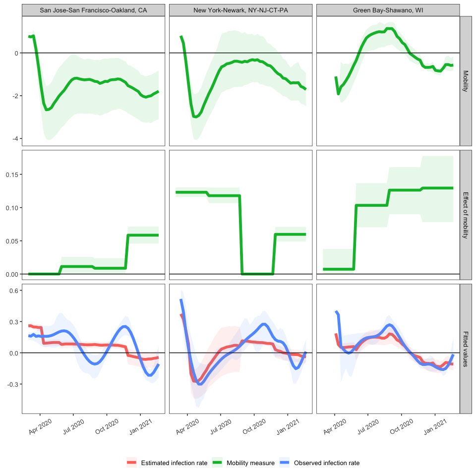<!-- -->

## Figure 5: Disaggregated model performance by division, subregion, and county-population disaggregations

R2 by week and county population quantile

``` r
knot_dates = args$knot_dates
fips_pop_quantiles_names = c("< 25k", "25k - 100k", "100k - 250k", "> 250k")
dates = "last_date"

plot_dat = df_r2_out %>% filter(type == paste0("fips_pop_quantiles_",dates)) %>%
  separate(group_val, sep = "_", into = c("fips_pop_quantiles", "date")) %>%
  mutate(fips_pop_quantiles = factor(fips_pop_quantiles, levels = fips_pop_quantiles_names),
         date = as.Date(date)) %>%
  rename(`County Population` = fips_pop_quantiles) %>%
  mutate(line_thick = "a")

plot_dat2 = df_r2_out %>% filter(type == dates) %>%
  mutate(date = as.Date(group_val)) %>%
  mutate(`County Population` = "Overall") %>%
  mutate(line_thick = "b") %>% select(-group_val)

plot_dat = bind_rows(plot_dat2, plot_dat) %>%
  mutate(`County Population` = factor(`County Population`, 
                                levels = c("Overall",rev(fips_pop_quantiles_names))))
  
plot_colors = c("#08519c","#3182bd","#6baed6","#bdd7e7")

ggplot(plot_dat, aes(x = date, y = q50)) +
  geom_line(aes(size = line_thick, color=`County Population`)) +
  geom_ribbon(aes(ymin = qLow, ymax = qHigh, fill=`County Population`), alpha = .25, color=NA) +
  list(
    scale_size_manual(values = c(a=0.8, b=1.4), guide=FALSE),
    scale_color_manual(values = c("Overall"="black",
                                  "> 250k" =plot_colors[1],
                                  "100k - 250k"=plot_colors[2],
                                  "25k - 100k"=plot_colors[3],
                                  "< 25k"=plot_colors[4])),
    scale_fill_manual(values = c("Overall"="black",
                                 "> 250k" =plot_colors[1],
                                 "100k - 250k"=plot_colors[2],
                                 "25k - 100k"=plot_colors[3],
                                 "< 25k"=plot_colors[4]))
  ) +
  xlab("Date") +
  ylab(bquote(R^2~ "(95% CI)")) +
  geom_vline(xintercept = as.Date(knot_dates[1]), alpha = .3) +
  geom_vline(xintercept = as.Date(knot_dates[2]), alpha = .3) +
  geom_vline(xintercept = as.Date(knot_dates[3]), alpha = .3) +
  ggtitle(bquote(R^2~ "by date and county population")) +
  theme_bw(12) +
  scale_x_date(breaks = breaks_pretty(12)) +
  theme(axis.text.x = element_text(size=8, angle=30)) 
```

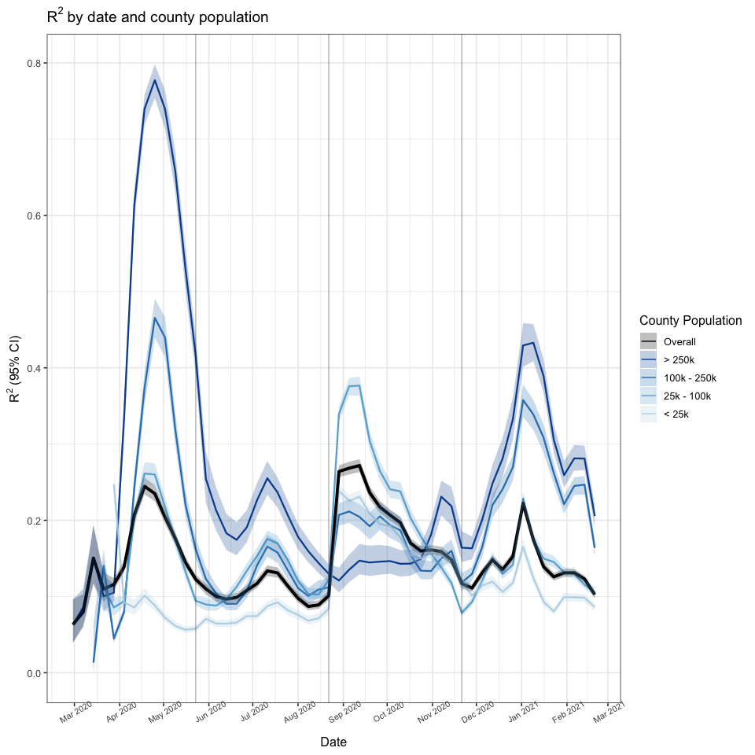<!-- -->

R2 by week and region

``` r
loc = "region"
dates = "last_date" 

plot_dat = df_r2_out %>% filter(type == paste0(loc,"_",dates)) %>%
  separate(group_val, sep = "_", into = c("loc", "date")) %>%
  mutate(date = as.Date(date)) %>%
  filter(ct >= 10) %>%
  mutate(line_thick = "a")

plot_dat2 = df_r2_out %>% filter(type == dates) %>%
  mutate(date = as.Date(group_val)) %>%
  mutate(loc = "Overall") %>%
  mutate(line_thick = "b") %>% select(-group_val)

plot_dat = bind_rows(plot_dat2, plot_dat) %>%
  mutate(loc = factor(loc, levels = c("Overall",sort(unique(plot_dat$loc)))))

plot_colors = c("#e41a1c","#377eb8","#4daf4a","#984ea3")
  
ggplot(plot_dat, aes(x = date, y = q50)) +
  geom_line(aes(size = line_thick, color=loc)) +
  geom_ribbon(aes(ymin = qLow, ymax = qHigh, fill=loc), alpha = .25, color=NA) +
  list(
    scale_size_manual(values = c(a=0.8, b=1.4), guide=FALSE),
    scale_color_manual(values = c("Overall"="black",
                                  "Midwest" =plot_colors[1],
                                  "Northeast"=plot_colors[2],
                                  "South"=plot_colors[3],
                                  "West"=plot_colors[4])),
    scale_fill_manual(values = c("Overall"="black",
                                 "Midwest" =plot_colors[1],
                                 "Northeast"=plot_colors[2],
                                 "South"=plot_colors[3],
                                 "West"=plot_colors[4]))
  ) +
  xlab("Date") +
  ylab(bquote(R^2~ "(95% CI)")) +
  ggtitle(bquote(R^2~ "by region and date")) +
  geom_vline(xintercept = as.Date(knot_dates[1])+3, alpha = .3) +
  geom_vline(xintercept = as.Date(knot_dates[2])+3, alpha = .3) +
  geom_vline(xintercept = as.Date(knot_dates[3])+3, alpha = .3) +
  theme_bw(12) +
  scale_x_date(breaks = breaks_pretty(12)) +
  theme(axis.text.x = element_text(size=8, angle=30)) 
```

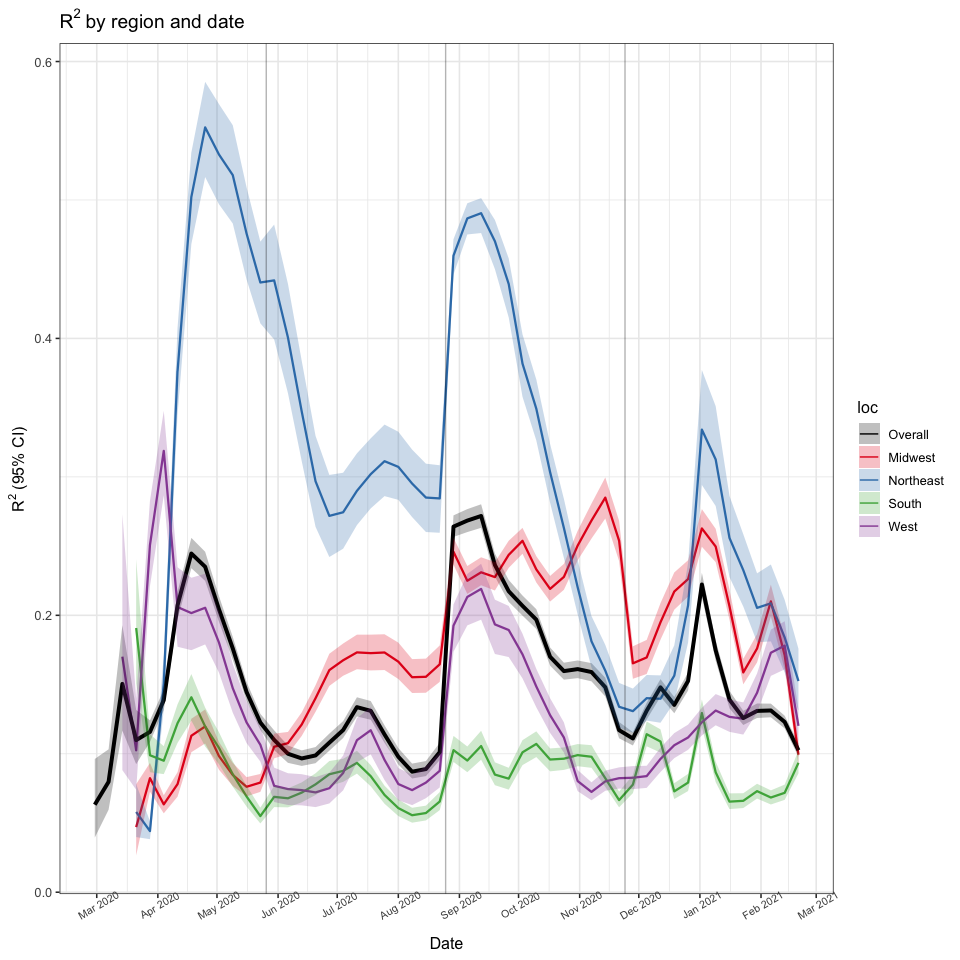<!-- -->

R2 as a function of mobility quantile and county population quantile

``` r
mob_qs_names = c("< 5%", "5 - 15%", "15 - 25%", "25 - 75%", "75 - 85%", "85 - 95%", "> 95%")
mob_qs_nums = c(1,2.5,4.5,10.5,16.5,18.5,20)

plot_dat = df_r2_out %>% filter(type == "mob_qs_fips_pop_quantiles") %>%
  separate(group_val, sep = "_", into = c("mob_qs", "fips_pop_quantiles")) %>%
  mutate(fips_pop_quantiles = factor(fips_pop_quantiles, levels = fips_pop_quantiles_names),
         mob_qs = as.numeric(mob_qs)) %>%
  rename(`County Population` = fips_pop_quantiles) %>%
  mutate(line_thick = "a")

plot_dat2 = df_r2_out %>% filter(type == "mob_qs") %>%
  mutate(mob_qs = as.numeric(group_val)) %>%
  mutate(line_thick = "b") %>% select(-group_val) %>%
  mutate(`County Population` = "Overall")

plot_dat = bind_rows(plot_dat2, plot_dat) %>%
  mutate(`County Population` = factor(`County Population`, 
                                      levels = c("Overall",rev(fips_pop_quantiles_names)))) %>%
  filter(ct >= 50)

plot_colors = c("#08519c","#3182bd","#6baed6","#bdd7e7")

ggplot(plot_dat, aes(x = mob_qs, y = q50)) +
  geom_line(aes(size = line_thick, color=`County Population`)) +
  geom_ribbon(aes(ymin = qLow, ymax = qHigh, fill=`County Population`), alpha = .25, color=NA) +
  list(
    scale_size_manual(values = c(a=0.8, b=1.4), guide=FALSE),
    scale_color_manual(values = c("Overall"="black",
                                  "> 250k" =plot_colors[1],
                                  "100k - 250k"=plot_colors[2],
                                  "25k - 100k"=plot_colors[3],
                                  "< 25k"=plot_colors[4])),
    scale_fill_manual(values = c("Overall"="black",
                                 "> 250k" =plot_colors[1],
                                 "100k - 250k"=plot_colors[2],
                                 "25k - 100k"=plot_colors[3],
                                 "< 25k"=plot_colors[4]))
  ) +
  ylab(bquote(R^2~ "(95% CI)")) +
  ggtitle(bquote(R^2~ "by mobility level and county population")) +
  theme_bw(12) +
  scale_x_continuous(name = "Mobility quantile", breaks = mob_qs_nums, labels = mob_qs_names) +
  theme(axis.text.x = element_text(size=8, angle=15)) 
```

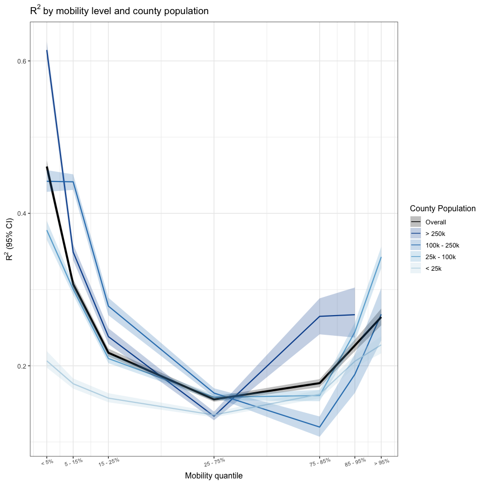<!-- -->

R2 as a function of mobility quantile and wave

``` r
plot_dat = df_r2_out %>% filter(type == "mob_qs_wave") %>%
  separate(group_val, sep = "_", into = c("mob_qs", "wave")) %>%
  mutate(mob_qs = as.numeric(mob_qs), 
         wave = as.character(wave)) %>%
  mutate(line_thick = "a")

plot_dat2 = df_r2_out %>% filter(type == "mob_qs") %>%
  mutate(mob_qs = as.numeric(group_val)) %>%
  mutate(line_thick = "b") %>% select(-group_val) %>%
  mutate(wave = "Overall")

plot_dat = bind_rows(plot_dat2, plot_dat) %>%
  # mutate(wave = factor(wave, levels = c("Overall", "1", "2", "3", "4"))) %>%
  filter(ct >= 50) %>%
  rename(Wave = wave)

plot_dat$Wave[plot_dat$Wave=="1"] = "2020-02-09 - 2020-05-23"
plot_dat$Wave[plot_dat$Wave=="2"] = "2020-05-30 - 2020-08-22"
plot_dat$Wave[plot_dat$Wave=="3"] = "2020-08-29 - 2020-11-21"
plot_dat$Wave[plot_dat$Wave=="4"] = "2020-11-28 - 2021-02-20"
plot_dat$Wave = factor(plot_dat$Wave, levels=c("Overall","2020-02-09 - 2020-05-23",
                  "2020-05-30 - 2020-08-22","2020-08-29 - 2020-11-21","2020-11-28 - 2021-02-20"))

plot_colors = c("#800026","#bd0026","#fd8d3c","#fed976")

ggplot(plot_dat, aes(x = mob_qs, y = q50)) +
  geom_line(aes(size = line_thick, color=Wave)) +
  geom_ribbon(aes(ymin = qLow, ymax = qHigh, fill=Wave), alpha = .25, color=NA) +
  list(
    scale_size_manual(values = c(a=0.8, b=1.4), guide=FALSE),
    scale_color_manual(values = c("Overall"="black",
                                  "2020-02-09 - 2020-05-23" =plot_colors[1],
                                  "2020-05-30 - 2020-08-22" =plot_colors[2],
                                  "2020-08-29 - 2020-11-21" =plot_colors[3],
                                  "2020-11-28 - 2021-02-20" =plot_colors[4])),
    scale_fill_manual(values = c("Overall"="black",
                                 "2020-02-09 - 2020-05-23" =plot_colors[1],
                                 "2020-05-30 - 2020-08-22" =plot_colors[2],
                                 "2020-08-29 - 2020-11-21" =plot_colors[3],
                                 "2020-11-28 - 2021-02-20" =plot_colors[4]))
  ) +
  xlab("Quantile of mobility (1=lowest, 20=highest)") +
  ylab(bquote(R^2~ "(95% CI)")) +
  ggtitle(bquote(R^2~ "by mobility level and wave")) +
  theme_bw(12) +
  scale_x_continuous(name = "Mobility quantile", breaks = mob_qs_nums, labels = mob_qs_names) +
  theme(axis.text.x = element_text(size=8, angle=15)) 
```

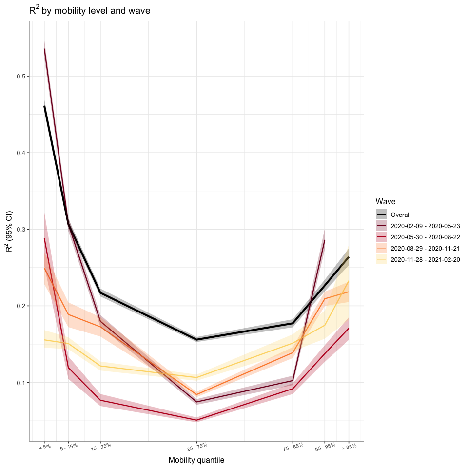<!-- -->

## Figure 6: Maps of model coefficients and performance by CSA and Wave

Maps of CSA coefficients by wave

``` r
mob_names = build_dyn_names(args)
mobility_coef_draws = get_coef_draws_by_group(fitted_model, "csa", mob_names)[["csa"]]
mobility_coef_draws$wave = 1
mobility_coef_draws$wave[mobility_coef_draws$term==mob_names[2]] = 2
mobility_coef_draws$wave[mobility_coef_draws$term==mob_names[3]] = 3
mobility_coef_draws$wave[mobility_coef_draws$term==mob_names[4]] = 4

csa_mobility_coefs_summary = mobility_coef_draws %>%
  group_by(csa, wave) %>%
  summarize(
    #cap coef values at a max for plotting
    mean = pmin(mean(pmax(.value,0)), 0.2),
    q50 = median(.value),
    lo = quantile(.value, .025),
    hi = quantile(.value, .975)
  ) %>% ungroup() %>%
  select(csa,wave,mean) 

fips_mobility_coefs_summary = csa_mobility_coefs_summary %>%
  left_join(aug_dat$weekly_dat %>% filter(week==max(week)) %>% select(fips,csa), by="csa")

wave_date_ranges = c("2020-02-29 - 2020-05-23","2020-05-30 - 2020-08-22",
                     "2020-08-29 - 2020-11-21", "2020-11-28 - 2021-02-20")
n_waves = length(wave_date_ranges)

for (i in 1:n_waves) {
  p_base = plot_usmap(regions = "counties", values = "mean", 
                      data = fips_mobility_coefs_summary %>% filter(wave == i),
                      size=0,color="#d9d9d9")
  
  p = p_base + 
    scale_fill_continuous(high = "blue", low="white", name = "Mobility Effect", 
                         limits = c(0,max(csa_mobility_coefs_summary$mean)), na.value = "#d9d9d9") +
    theme(legend.position = "right") +
    ggtitle(wave_date_ranges[i])

  print(p)
}
```

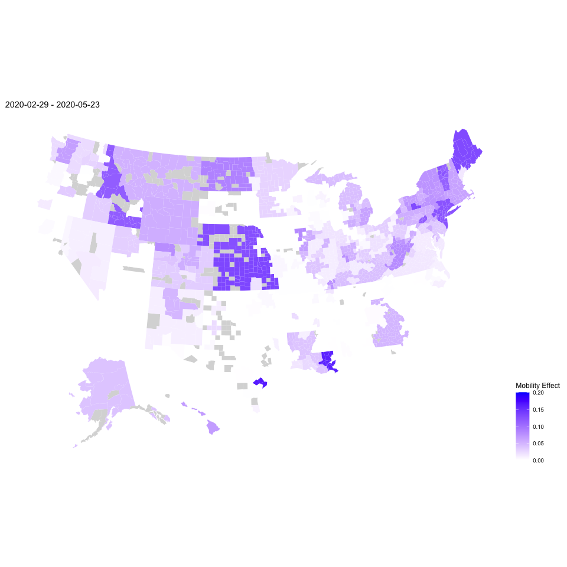<!-- -->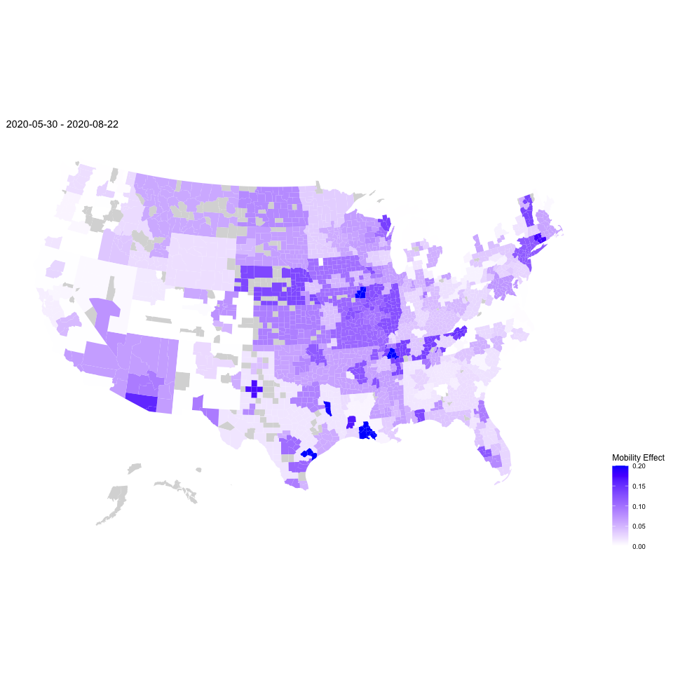<!-- -->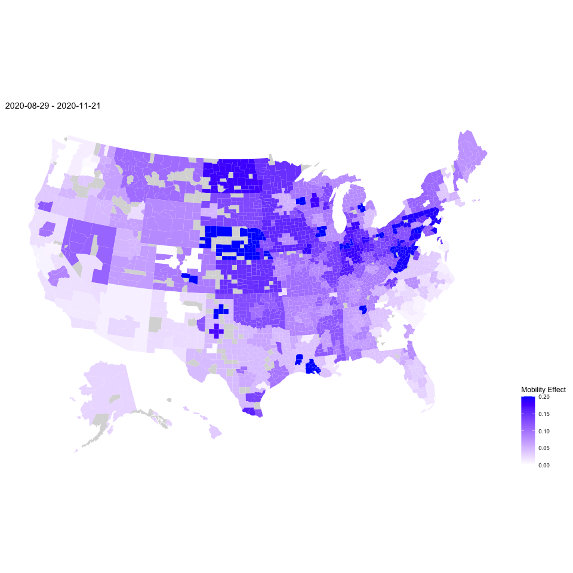<!-- -->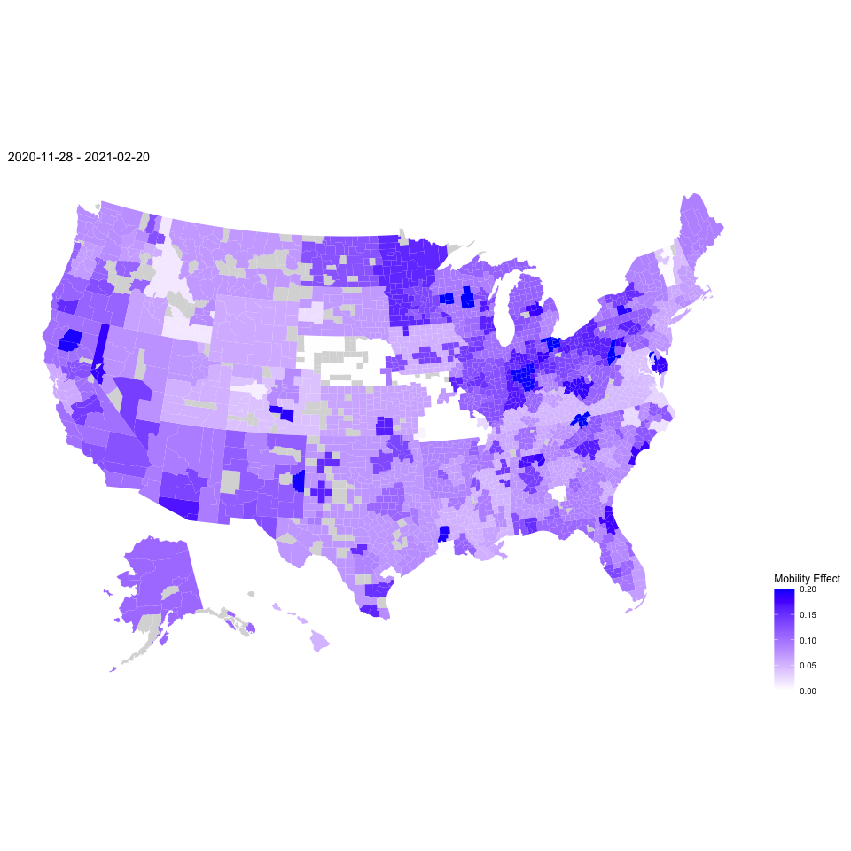<!-- -->

Maps of CSA R2 by wave

``` r
csa_waves_r2_dat = df_r2_out %>% filter(type == "csa_wave") %>%
  separate(group_val, sep = "_", into = c("csa", "wave")) 

csa_fips_waves_r2_dat = csa_waves_r2_dat %>%
  left_join(aug_dat$weekly_dat %>% filter(week==max(week)) %>% select(fips,csa), by="csa") %>%
  mutate(q50 = pmin(q50, .6)) #prune most extreme outliers for plotting

for (i in 1:n_waves) {
  p_base = plot_usmap(regions = "counties", values = "q50", 
                      data = csa_fips_waves_r2_dat %>% filter(wave == i),
                      size=0,color="#d9d9d9")
  p = p_base + 
    scale_fill_continuous(high = "red", low="white", name = "R2", 
                          limits = c(0,max(csa_fips_waves_r2_dat$q50)), na.value = "#d9d9d9") +
    theme(legend.position = "right") +
    ggtitle(wave_date_ranges[i])

  print(p)
}
```

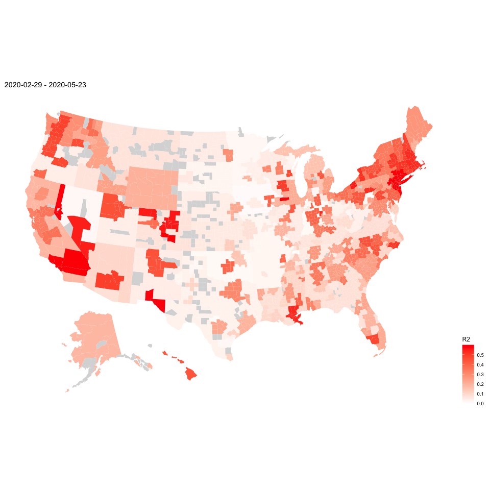<!-- -->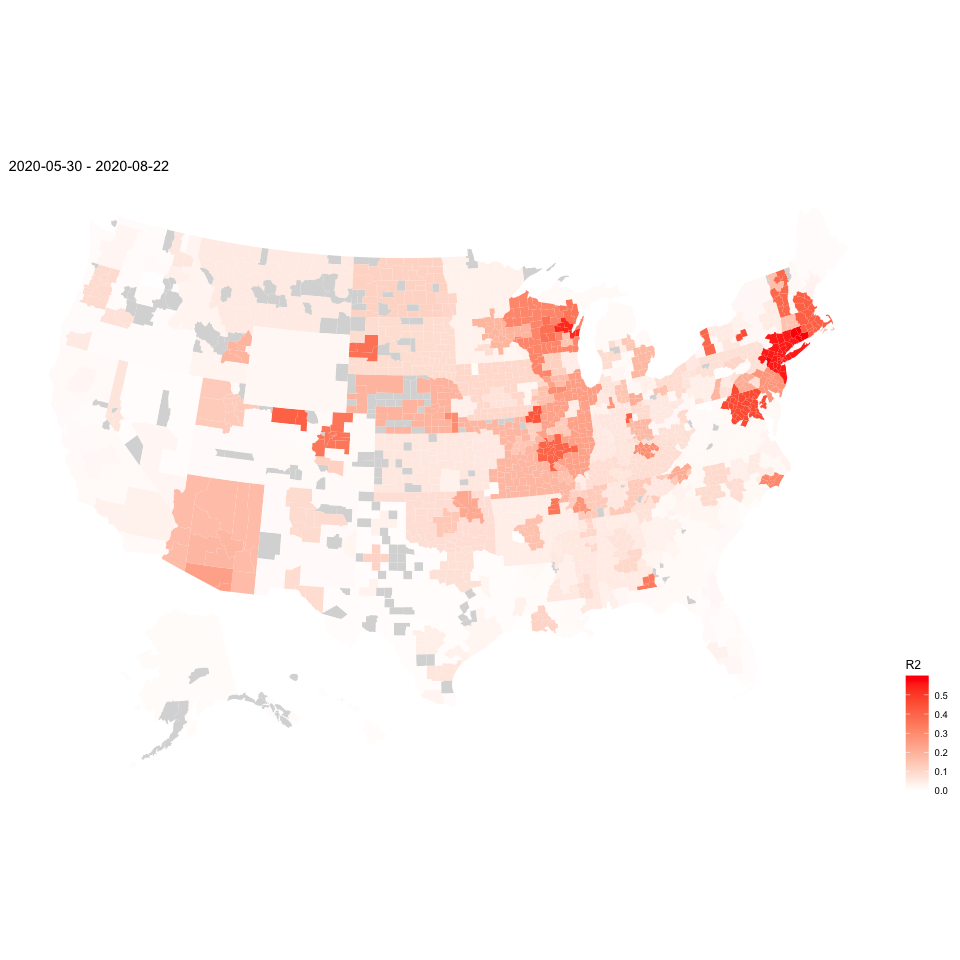<!-- -->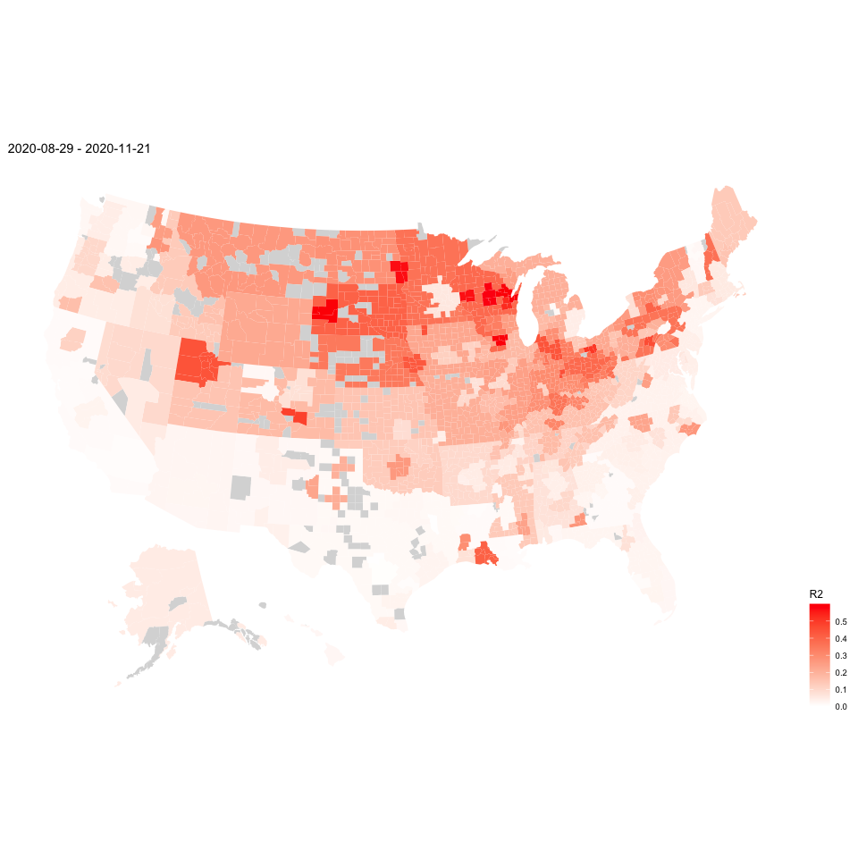<!-- -->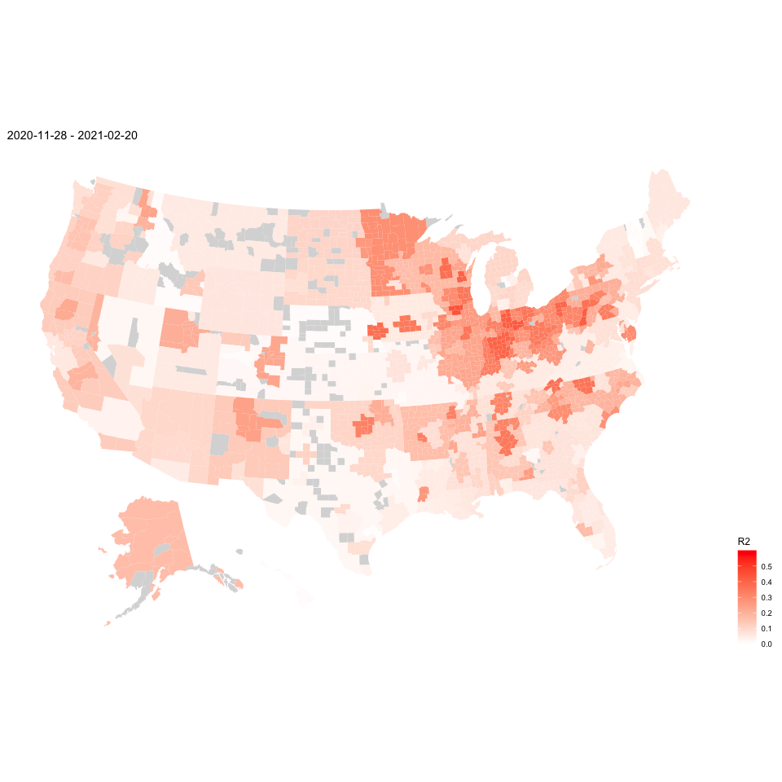<!-- -->

# References

It’s complicated: characterizing the time-varying relationship between
cell phone mobility and COVID-19 spread in the US Sean Jewell, Joseph
Futoma, Lauren Hannah, Andrew C. Miller, Nicholas J. Foti, Emily B. Fox
medRxiv 2021.04.24.21255827; doi:
<https://doi.org/10.1101/2021.04.24.21255827>
